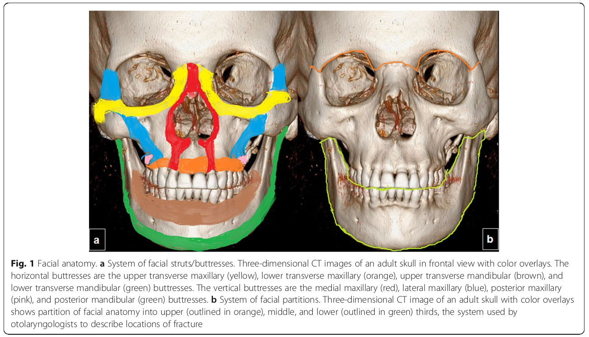
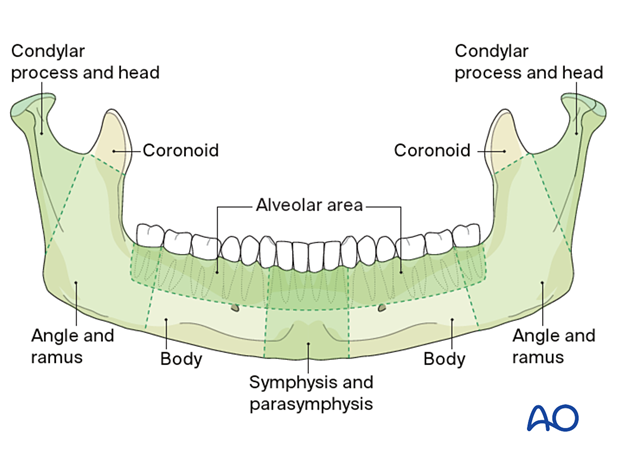
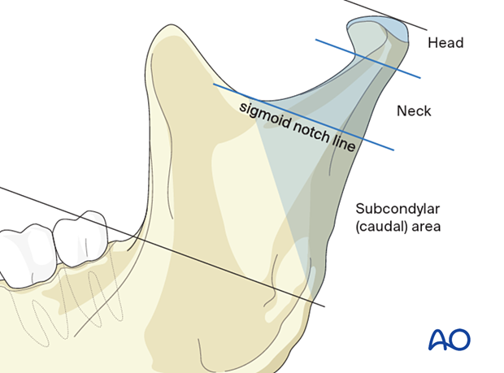
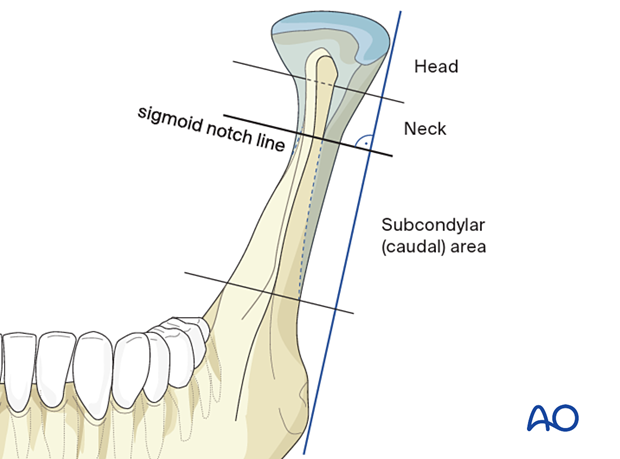

# Facial Trauma

## Clinical 

## Radiological Approach 

| Buttress Fractures | Pterygoid Process | Classification | Sub-Classification or Notes |
|---|---|---|---|
| Multiple | Fractured | **LeFort I** | Anterolateral margin of the nasal fossa. |
| | | **LeFort II** | Inferior Orbital Rim |
| | | **LeFort III** | Zygomatic Arch | 
| | Not fractured | Medial = **Naso-orbito-ethmoidal complex**. *Markowitz & Manson* | **Type 1** -> Medial canthal tendon is intact and connected to a single large fracture fragment. |
| | | | **Type II** -> Fracture comminuted but the tendon is attached to a single bone fracture. |
| | | | **Type III** -> Comminution extends to the medial canthal tendon insertion site on the anterior medial orbital wall at the level of the lacrimal fossa leading to tendon avulsion. |  
| | | Lateral = **Zygomaticomaxillary complex** | | 
| One or a few only | | Mandible = Characterised by location. | | 
| | | Orbital Fractures | | 
| | | Frontal Sinus Fractures | | 
| | | Alveolar Process | | 
| | | Nasal Bone | |

## General 

## Mandible

