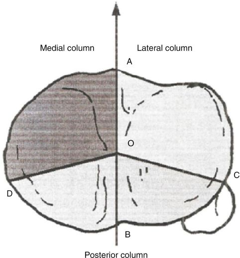

# FF_Knee.

## Table of Contents
- [FF_Knee.](#ff_knee)
	- [Table of Contents](#table-of-contents)
	- [**Anatomy, Procedure & Technical**](#anatomy-procedure--technical)
	- [**Guidelines**](#guidelines)
	- [**Clinical**](#clinical)
		- [Tibial Plateau Fractures.](#tibial-plateau-fractures)
			- [***Schatzker Classification***](#schatzker-classification)
			- [***3 Column Model***  [^Lopes2014]](#3-column-model--lopes2014)
		- [Distal Femoral Fractures.](#distal-femoral-fractures)
	- [**Differentials**](#differentials)
	- [**Radiological**](#radiological)
	- [**How to Report**](#how-to-report)
	- [**Papers**](#papers)
	- [References](#references)
---

## **Anatomy, Procedure & Technical**

### Meniscus  
[^Hegazi2020]

[^Hegazi2020]: Musculoskeletal MRI: A Case-Based Approach to Interpretation &
	Reporting. Hegazi TM & Wu JS. Springer Nature 2020.
	https://doi.org/10.1007/978-3-030-26777-3 

Made up of 3 parts: **Anterior Horn**, **Body** & **Posterior Horn**.  
Both have Anterior and Posterior **root** attachment to tibia.  

Medial = Bigger. Posterior > Anterior.   
-	Relatively immobile due to capsule attachment + Deep MCL.  
Lateral = Smalller. Posterior = Anterior.  
- **Anterior & Posterior meniscofemoral ligaments of Humphrey & Wrisberg**
		attach to posterior horn.   
- Anterior horn = speckled.
**Anterior Transverse Meniscal Ligament** connects the two menisci.
	
---

## **Guidelines**

---

## **Clinical**

### Tibial Plateau Fractures.

Move away from Schatzker to 3 column model.  
But not much in Radiology literature - await [^Bryson2021] to be available.  
In meantime use [^Lopes2014], very little else available.  

[^Bryson2021]: Three-Column Classification System for Tibial Plateau Fractures: What the Orthopedic Surgeon Wants to Know Wesley N. Bryson, Eric J. Fischer, Jack W. Jennings, Travis J. Hillen, Michael V. Friedman, and Jonathan C. Baker RadioGraphics 2021 41:1, 144-155 https://doi.org/10.1148/rg.2021200106 

[^Lopes2014]: Lopes, Clécio de Lima, Cândido Filho, Carlos Antônio da Rocha, Silva, Thiago Almeida de Lima e, Gonçalves, Marcelo Carvalho Krause, Oliveira, Ricardo Lyra de, & Lima, Paulo Rogério Gomes de. (2014). Importance of radiological studies by means of computed tomography for managing fractures of the tibial plateau,. Revista Brasileira de Ortopedia, 49(6), 593-601. https://dx.doi.org/10.1016/j.rboe.2014.10.010

#### ***Schatzker Classification***

| Type | Description                                                                     | Notes                                                                           |
| :--- | :------------------------------------------------------------------------------ | :------------------------------------------------------------------------------ |
| I    | Lateral split fracture with no depression.                                      |                                                                                 |
| II   | Lateral split/wedge fracture with depression.                                   | Usu elderly with OSP                                                            |
| III  | Focal depression of articular surface but no split.                             | Elderly with OSP                                                                |
| IV   | Medial plateau split +/- Depression.                                            | May involve tibial spines. Please see NB below. LCL & posterolateral corner. |
| V    | Split +/- depression of both medial & lateral plateau.                          | ACL & Meniscal injuries common.                                                 |
| VI   | Bicondylar or unicondylar split with transverse fracture through metadiaphysis. |

NB: Lateral plateaus that extend to medial articular surface adjacent to tibial spines but no depression or extension to metaphyseal cortex then not considered to involve medial plateau in terms of classification.   

#### ***3 Column Model***  [^Lopes2014] 

Uses axial views and divides into 3 columns : Lateral, Medial and Posterior columns.   
Do this via 3 lines with centre at O.
 - A = Anterior tuberosity.
 - D = Posteromedial edge of proximal tibia.
 - C = Anterior point of head of fibula.
 - B = Posterior sulcus of tibial plateau, divides posterior column into medial and lateral. 

 

Use MPRs to assess, especially Coronal.   
**'Fracture of column': 'Depression with cortical fracture of the column.'** 
Thus pure joint depression not involving cortex = Zero column fracture.
Most common ones = lateral shear = One column fracture.  
Schatzker IV is usually a Two-column.

### Distal Femoral Fractures.

---

## **Differentials**

---

## **Radiological**

### Meniscus 

#### Tears  

***Signal abutting a surface.***
2 Slice: PPV = 0.95 for a tear.
1 Slice: PPV = 0.3-0.5 for a tear. Call as 'possible tear'.  
***Parameniscal Cyst***.
Nearly always there is an underlying tear.
**Except** for anterior horn of lateral meniscus.

---

## **How to Report** 

---

## **Papers**

--- 

## References
