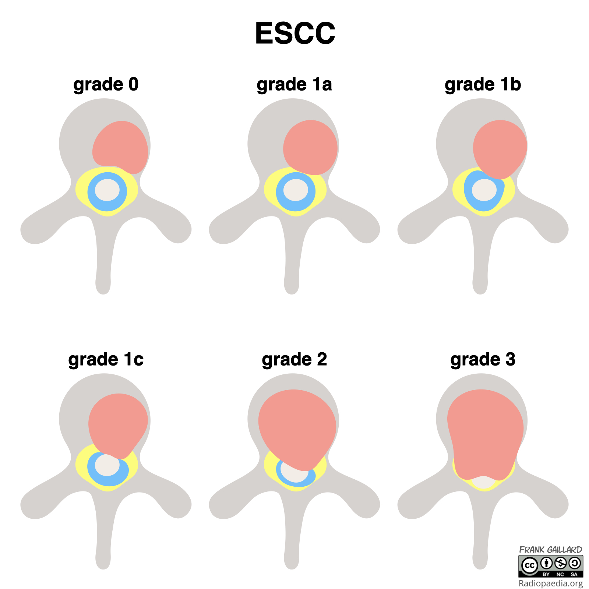

--- 

title = "MSCC"

---

# Metastatic Cord Compression.

### Epidural Spinal Cord Compression Scale

#### ***Bilsky Scale*** or ESCC

**Grade 0** : Bone - only disease.  
**Grade 1** : Epidural extension WITHOUT cord compression.
	- 1a = No deformation of thecal sac.
	- 1b = Deformation of sac but NO cord abutment.
	- 1c = Deformation WITH cord abutment.  
**Grade 2** : Spinal cord compression WITH CSF around cord.
**Grade 3** : Spinal cord compression NO CSF around cord.  