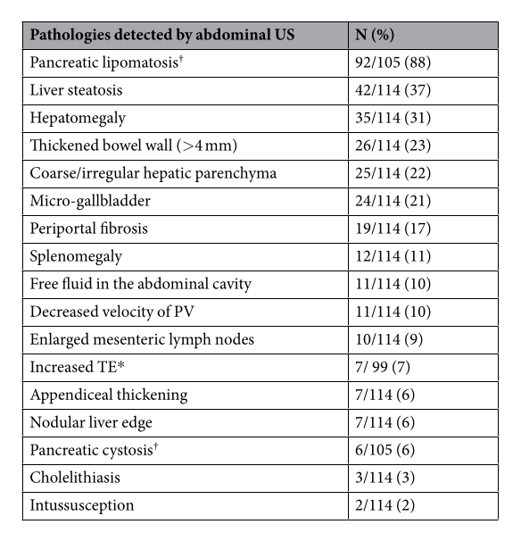
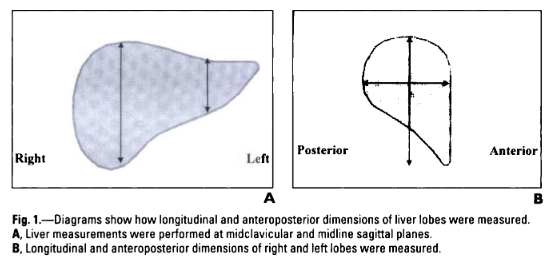

# Cystic Fibrosis 
. [Cystic Fibrosis](#cystic-fibrosis)
	1. [Guidelines = NICE NG78 2017 [^1]](#guidelines--nice-ng78-2017-1)
		1. [1.5 Annual and routine reviews](#15-annual-and-routine-reviews)
		2. [1.7 Other monitoring, assessment and management.](#17-other-monitoring-assessment-and-management)
			1. [Distal Intestinal Obstruction Syndrome (DIOS)](#distal-intestinal-obstruction-syndrome-dios)
			2. [Liver Disease](#liver-disease)
		3. [BUT](#but)
			1. [We are in the RBH/Kings/Bton Sphere of Influence](#we-are-in-the-rbhkingsbton-sphere-of-influence)

## Guidelines = NICE NG78 2017 [^1]

### 1.5 Annual and routine reviews
... *Radiology mentioned for Lungs, DIOS & Liver.*

1.6.4 Include the following at each annual review in relation to pulmonary assessment for people with cystic fibrosis:

- a clinical assessment, including a review of the clinical history and medicines adherence, and a physical examination, with measurement of weight and length or height

- a physiotherapy assessment

- measurement of oxygen saturation

- **a chest X-ray**

- blood tests, including white cell count, aspergillus serology and serum IgE

- taking respiratory secretion samples for microbiological investigations (including non-tuberculous mycobacteria)

- lung function testing (for example with spirometry, including FEV1, FVC, and FEF 25–75%) in adults, and in children and young people who can do this.
... 

1.6.7 Think about doing a **low-dose chest CT scan** for children with cystic fibrosis who have not had a chest CT scan before, to detect features that other tests (such as a plain chest X-ray) would miss (for example early bronchiectasis).

1.6.8 Think about doing a **chest X-ray** for people with cystic fibrosis during or after treatment for an exacerbation of lung disease (taking account of severity), if:

- the exacerbation does not respond to treatment or

- a **chest X-ray** before treatment showed new radiological abnormalities.

### 1.7 Other monitoring, assessment and management. 

... 

#### Distal Intestinal Obstruction Syndrome (DIOS)

1.7.8 Be aware that a variety of conditions can cause acute abdominal pain and resemble distal intestinal obstruction syndrome in people with cystic fibrosis, for example:

- constipation

- appendicitis

- intussusception

- cholecystitis.

1.7.9 Suspect distal intestinal obstruction syndrome in people with cystic fibrosis who have an acute onset of peri-umbilical or right lower quadrant abdominal pain and any of the following:

- a palpable mass in the right lower quadrant

- faecal loading in the right lower quadrant on a **plain abdominal X-ray**, especially if associated with small intestine air-fluid levels

- clinical features of partial or complete intestinal obstruction, such as vomiting (especially bilious) and abdominal distension.

1.7.10 For people who have an acute onset of peri-umbilical abdominal pain but no other clinical or radiological features of distal intestinal obstruction syndrome, **consider further imaging**, for example with an:

- **abdominal ultrasound scan** or

- **abdominal CT scan**.

... *Says manage in specialist centre with Gastrograffin as first line*

#### Liver Disease 

1.7.17 Perform a clinical assessment and liver function blood tests at the annual review for people with cystic fibrosis.

1.7.18 If liver function blood tests are **abnormal**, perform a **liver ultrasound** scan and consider ursodeoxycholic acid treatment.

... Other stuff about referring on. 

### BUT 

#### We are in the RBH/Kings/Bton Sphere of Influence 

RBH Guidelines are [here](https://www.rbht.nhs.uk/sites/nhs/files/Cystic%20fibrosis%20guidelines/CF%20G%202020/7.pdf) [^2]

They state: 
"Routine annual assessment ultrasound on alternate years from aged 5 years and above. It will be repeated in 1 year if abnormal."  

But then state that it includes ISHAK measure of fibrosis despite not having any validation in paeds and is reported as a 'standardised manner'. 

#### And Other tests are just as useless. Lots of continued interest in US. [^4] 

Several study groups but 'keen' and use case-control design in kids with advanced CF to demonstrate correlations between crude findings and other crude findings. [^3] *Essentially*  

As fewer die from nutritional/pancreatic and lung failure then role of CFLD becomes more prominent with 30-50% of patients with it and 8% dying from it.

Range of hepatic disorders seen in CF include: Liver fibrosis and cirrhosis. But also cholestasis, fatty infiltration as well as biliary tree abnormalities including - sclerosing cholangitis, cholelithiasis, micro-gallbladder and gallbladder dyskinesia.  

Most are asymptomatic thus idea is that we should spot it before they die of portal hypertension related complications. Are treated with transplantation.

The changes of fibrosis & cirrhosis are patchy and only occasionally multilobular so random biopsy or other tests are not so great. 
- LFTs are ok but underexpression of a CFTR protein means the ALT and AST are worse then expected at predicting abnormality but still correlated.
- GGT is better. And for both, absolute values count 
- All biochemical measures of fibrosis are probably ok. 
- TE, ARFI etc is good but problem with patchy distribution and a sign of advanced disease and increasingly is used as the reference instead of biopsy.  

Most of the 2017-2021 US CFLD papers show that 'Nodular' liver ( vs 'Echogenic*' or 'Normal') is associated with raised ALT/AST/GGT, signs of fibrosis and TE/ARFI etc. But none are very 

* Echogenic means diffuse parenchymal echogenicity as well as periportal hyperattenuation.

But, Tabori et al [^5] looked at wide range of findings on Abd US and correlated with clinical symptoms. Found good correlation with abdominal symptomatology including reflux and pain and features in keeping with pancreatic insufficiency and US features of CF. 

---

## Report.

### How to Report it in a Reasonably structured way. 

Based on Jena Hospital CF clinic work [^5]  
Used 17 parameters below and gave 1 point for presence (= US-17)

| ITEM | DEFINITION ON US | NOTES |
:---|:---|:---|
||**LIVER** | |  
Hepatomegaly | Mid-clavicular line CC dimension | Adults: >16cm is enlarged.  |   
Liver Steatosis | Increased echogenicity compared to renal parenchyma et al. | | 
Parenchymal Coarseness |  |  | 
Nodular Border | | | 
Periportal Fibrosis |  | Refers to Willams' work in CXH |  
*TE* | Abnormal > 7.1kPa |  |
||**PORTAL HYPERTENSION** | | 
PV Flow | Abnormal <15cm/s  | |  
Splenomegaly | Max CC through Hilum | But not much data on this measure in US. ?use long-axis vs 1.25 x BPL of LK. See below.|  
Ascites | | |   
||**BILIARY TREE**|| 
Cholecystolithiasis | Gallstones in gallbladder | | 
Micro-gallbladder | <2-3cm long or >0.5-1.5cm wide | |
||**PANCREAS**||
Lipomatosis | Echogenicity partly or completely higher than liver or kidney| | 
Cystosis | >1cm simple cysts in pancreas| Usually the last stage of pancreatic insufficiency | 
||**BOWEL**|| 
Bowel Wall thickness | Mucosa -> Outer hyperechoic wall >4mm | | 
Appendix Thickening | Diameter > 6mm | | 
Enlarged Mesenteric Nodes | >5mm SAD or >10mm LAD | | 
Intussusception | | |

### Findings on US 

50% of px >18yo 
93% Had Pancreatic Exocrine Insufficiency 

--- 

### Liver Size 

Via *Diagnostic Pediatric Ultrasound* Beek A & van Rijn RR. = Normal Liver, spleen, kidney dimensions in neonates, infants & children. Konus OL, Ozdeimer A, Akkaya A et al. AJR 1998; 171(6):1693-1698.  

NB: Each of the categories is based on 16 to 53 samples only. Done in Turkey.

**Technique**: Longitudinal dimension of the RIGHT lobe taken Mid-clavicular line.
Measured the orthogonal z-axis if top level was the highest point of the diaphragm and the lowest level was that of the tip.

*AGE* | *LIMITs OF NORMAL*
:---|:---
3 months | 4.0 - 9.0cm
6 months | 4.5 - 9.5cm 
9 months | 6.0 - 10.0cm
1 - 2.5 years | 6.5 - 10.5cm 
3-5 years | 6.5 - 11.5cm 
5-7 years | 7.0 - 12.5cm 
7-9 years | 7.5 - 13.0cm 
9-11 years | 7.5 - 13.5cm 
11-13 years | 8.5 - 14.0cm 
13-15 years | 8.5 - 14.0cm 
15-17 years | 9.5 - 14.5cm.  

### Spleen Size 

Via Radiopaedia. = Normal Splenic size in Infants & Children.Rosenberg HK AJR 1991;157(1):119-121

*AGE* | *UPPER LIMIT OF NORMAL*
:---|:---
3 months | 6.0cm
6 months | 6.5cm 
12 months | 7.0cm 
2 years | 8.0cm 
4 years | 9.0cm 
6 years | 9.5cm 
8 years | 10.0cm 
10 years | 11.0cm 
12 years | 11.5cm 
15 years+ | 12.0cm Girls. 13.0cm Boys 

--- 

[^1]: NICE https://www.nice.org.uk/guidance/ng78/chapter/Recommendations#annual-and-routine-reviews

[^2]: RBHT https://www.rbht.nhs.uk/sites/nhs/files/Cystic%20fibrosis%20guidelines/CF%20G%202020/7.pdf

[^3]: New Algorithm for the Integration of US into Cystic Fibrosis Liver Disease Screening. Sellers ZM, Lee LW, Barth RA et al. Journal of Pediatric Gastroenterology and Nutrition 69(4):404-410 Oct 2019. 

[^4]: Non-invasive Diagnostic Tests in Cystic Fibrosis-Related Liver Disease: A Diagnostic Test Accuracy Network Meta-Analysis. Martonosi ÁR, Soós A, Rumbus Z et al. Front. Med. 8:598382. doi: 10.3389/fmed.2021.598382

[^5]: Relation of Ultrasound Findings and abdominal symptoms obtained with the CFAbd-Score in Cystic Fibrosis Patients. Tabori H, Jaudszus A, Arnold C et al. SCIENTIFIC REPORTS | 7: 17465 | DOI:10.1038/s41598-017-17302-4

