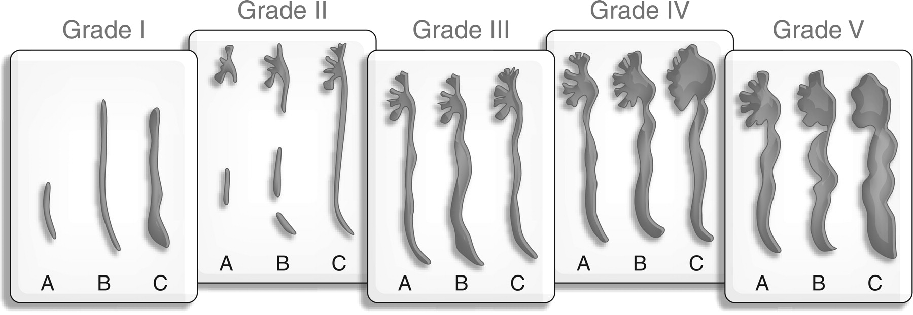

### [EBR](/EBR/README.md)

# Paediatric Urology.
## The guidelines for the usual presentations.   
1. [Paediatric Urology.](#paediatric-urology)
	1. [The guidelines for the usual presentations.](#the-guidelines-for-the-usual-presentations)
		1. [The 2022 EAU Guidelines are available here](#the-2022-eau-guidelines-are-available-here)
		2. [Cryptorchidism \[^Uroweb2021\]](#cryptorchidism-uroweb2021)
			1. [Classification \& Phrases](#classification--phrases)
			2. [Investigation.](#investigation)
			3. [Managment.](#managment)
		3. [Testicular Microlithiasis.](#testicular-microlithiasis)
			1. [Diagnosis](#diagnosis)
			2. [Management](#management)
		4. [Scrotal Swelling / Hydrocele / Hernia. \[^Uroweb2021\]](#scrotal-swelling--hydrocele--hernia-uroweb2021)
			1. [Diagnosis.](#diagnosis-1)
			2. [Treatment.](#treatment)
		5. [Varicocele in Children](#varicocele-in-children)
			1. [Imaging](#imaging)
		6. [Antenatal Hydronephrosis. \[^UTD2014\]](#antenatal-hydronephrosis-utd2014)
			1. [Postnatal.](#postnatal)
				1. [Management.](#management-1)
		7. [UTI *NICE* \[^NICE2018\] \[^NICE2022\]](#uti-nice-nice2018-nice2022)
				1. [Atypical UTI](#atypical-uti)
				2. [Recurrent UTI](#recurrent-uti)
			1. [Infants \< 6 months old](#infants--6-months-old)
			2. [Infants and Children 6 Months to 3 years old.](#infants-and-children-6-months-to-3-years-old)
			3. [Children \> 3years old.](#children--3years-old)
			4. [Also in the Guidance.](#also-in-the-guidance)
		8. [Vesicoureteric Reflux.](#vesicoureteric-reflux)
		9. [Lower Urinary Tract Symptoms \[^Dynamed2022\] \[^PIER2021\] \[^NICE2010\] \[^Fuentes2019\]](#lower-urinary-tract-symptoms-dynamed2022-pier2021-nice2010-fuentes2019)
			1. [__**Definitions**__ ( International Children's Continence Society (ICCS) Document )](#definitions--international-childrens-continence-society-iccs-document-)
			2. [__**Guidance**__](#guidance)

--- 

### The 2022 EAU Guidelines are available [here](../CrowNEST/../../CrowNEST/Papers/EAU_Paed_Uro_2022.pdf)

--- 

### Cryptorchidism [^Uroweb2021]

3% of full-term infants. 20% of prems. 
1% of Full-term infants at 1y have an undescended testis.
- 30% of cases are bilateral. Strong association with DSD.

#### Classification & Phrases 

***Undescended Testis*** = On the normal path but stopped usual descent.  
***Ectopic Testis*** = Off the normal path & outside scrotum.
- Most common is Superficial Inguinal Pouch, Others are femoral, perineal, pubic, penile or contralateral. 
- Almost all need an op.  
***Retractile Testis*** = Have descended normally then can be found in suprascrotal positions due to overactive cremasteric reflex.
- Will be manipulable easily into normal position & usually normal testis. 
- 1/3 will ascend and not come down. Thus, need monitoring. 

#### Investigation. 

'... use of **imaging** ... is limited and only for specific scenarios eg identification of Mullerian structures in a ? DSD.'  
This is because of limited sensitivity in abdomen and elsewhere. And limited specificity.  

#### Managment. 
At 6m as low probability of resolution later.  
Complete treatments by 12- 18mo as from this age there is loss of Germ & Leydig cells.  
Aims of treatment are adult hormone production, speramtogenesis and risk of malignancy. 

--- 

### Testicular Microlithiasis. 

#### Diagnosis

Either *5 per high power field* or *10 per testis* 
Though clustering is important and concerning.
Diffuse with atrophy is concerning and associated with infertility.

#### Management 

ESUR recommend Annual US surveillance only if they have one of these risk-factors. [^ESUR2016]
- Previous GCT 
- History of maldescent.
- Prior Orchidopexy.
- Atrophy with volume < 12ml. 
- First - degree relative with a history of GCT. 

[^ESUR2016]: Richenberg JR, Testicular microlithiasis imaging and follow-up: guidelines of the ESUR scrotal imaging subcommittee. Eur Radiol (2015) 25:323–330 
  
---

### Scrotal Swelling / Hydrocele / Hernia. [^Uroweb2021]

***Primary Hydrocele*** <= Patent Processus Vaginalis.  
Persistent processus forms 'communicating hydroceles' 
But, processus is patent in approx 20% of Adults! 

#### Diagnosis. 
'... diagnosed with history-taking and physical investigation.'
- **History**
- - Variability with time and ambulation.
- **Physical**
- - Transillumination.  

**Ultrasound** for '... any doubts about the character of an intrascrotal mass.'

#### Treatment. 
Under 12m leave alone as many resolve. Incarceration = RARE though a hernia on US is normally an indication for surgery. 
Over 12m debatable whether surgery or no surgery as no evidence simple hydrocele will damage the testis and NH is not clear over 2ys old.   

Later onset hydroceles, suggesting secondary, then leave for 6 to 9 months as 75% resolve. 

--- 

### Varicocele in Children 

**Uroweb**[^Uroweb2021] states:  
- 15%+ of adolescents. 85% are LEFT sided.
- Development relates to ^^ Blood flow.
- Varicocele can => Heat stress => Abnormal in 45%, Severe 20%.
- - 20% Infertilty.
- Can get catch up growth post varicolectomy. But no need until they are an adolescent.

#### Imaging 
'Extension of Wilms tumour into the renal vein and inferior vena cava can cause a secondary varicocele. A renal US should be routinely added in pre-pubertal boys and in isolated right varicocele (LE: 4).'
> But 2 papers are quoted, neither demonstrate the rate/outcome that this presentation happens instead they deal with the effects of a varicocele.

Also suggest doing the Anna Thornton stand up and demonstrate the reversal of blood flow when erect thing?? 

iREFER[^iREFER2021] just talks about infertility and does NOT mention doing US Kidneys.
  
---

### Antenatal Hydronephrosis. [^UTD2014]

Based on consensus from ACR, AIUM, ASPN, SFU, SPU, SRU and others. 

Defined both 'A' = antenatal findings and management *and*
'P' = postnatal findings and management. 

#### Postnatal. 
- For >48hrs post delivery.  

| Risk Level              | APRPD         | Calyceal Dilatation         | Parenchyma                            | Ureters      | Bladder      |
| :---------------------- | :------------ | :-------------------------- | :------------------------------------ | :----------- | :----------- |
| LOW = 'UTD P1'          | **10- <15mm** | **Central only**.           | Normal Thickness & Appearance.        | Normal       | Normal       |
| INTERMEDIATE = 'UTD P2' | **>=15mm**    | Central &/or **Peripheral** | Normal Thickness or Appearance        | **Abnormal** | Normal       |
| HIGH = 'UTD P3'         | >=15mm        | Central &/or Peripheral     | **Abnormal Thickness or Appearance**. | Abnormal     | **Abnormal** |

##### Management. 

| Level  | Follow Up US   | MCUG                      | Abx                       | MAG3 / Functional Scan    |
| :----- | :------------- | :------------------------ | :------------------------ | :------------------------ |
| UTD P1 | 1 to 6 months. | *Discretion of clinician* | *Discretion of clinician* | Not recommended.          |
| UTD P2 | 1 to 3 months  | *Discretion of clinician* | *Discretion of clinician* | *Discretion of clinician* |
| UTD P3 | 1 month        | Recommended               | Recommended               | *Discretion of clinician* |

--- 

### UTI *NICE* [^NICE2018] [^NICE2022]

##### Atypical UTI 
- Seriously ill. 
- Septicaemia
- Poor urine flow.
- Abdominal or Bladder mass.
- Raised Creatinine
- Infection with non E.coli organisms
- Failure to respond to treatment with suitable Abx in <48 hrs.

##### Recurrent UTI 

- 2 or more episodes of UTI with acute pyelonephritis/upper urinary tract infection, or
- 1 of upper AND 1 or more of lower, or
- 3 or more episodes of UTI with cystitis / lower UTI. 

#### Infants < 6 months old 

Test | Good response <48/24 | Atypical UTI | Recurrent UTI
---|---|---|---|
USS during Acute | No | Yes | Yes 
USS < 6 wk | Yes^a^ | No | No 
DMSA 4-6M | No | Yes | Yes 
MCUG | No | Yes | Yes 

> a = If abnormal, consider MCUG.

#### Infants and Children 6 Months to 3 years old.

Test | Good response <48/24 | Atypical UTI | Recurrent UTI
---|---|---|---|
USS during Acute | No | Yes | No 
USS < 6 wk | No | No | Yes 
DMSA 4-6M | No | Yes | Yes 
MCUG | No | No ^a^ | No ^a^

> a = Consider MCUG if following present
> - Dilatation on US.
> - Poor urine flow.
> - Non E-coli infection.
> - FH of VUR. 

#### Children > 3years old. 

Test | Good response <48/24 | Atypical UTI | Recurrent UTI
---|---|---|---|
USS during Acute | No | Yes | No 
USS < 6 wk | No | No | Yes 
DMSA 4-6M | No | No | Yes 
MCUG | No | No  | No 

> US in toilet-trained kids should be with FB and PMR.

In all of the above, a child with a non E.coli infection but no other atypical features and responding well to treatment, then US can be done on a delayed basis. 

#### Also in the Guidance.

1.5.1.7 Infants and children with a minor, unilateral renal parenchymal defect do not need long-term follow-up unless they have recurrent UTI or family history or lifestyle risk factors for hypertension. [2007]

1.5.1.8 Infants and children who have bilateral renal abnormalities, impaired kidney function, raised blood pressure and/or proteinuria should receive monitoring and appropriate management by a paediatric nephrologist to slow the progression of chronic kidney disease. [2007]

1.5.1.9 Infants and children who are asymptomatic following an episode of UTI should not routinely have their urine re-tested for infection. [2007]

1.5.1.10 Asymptomatic bacteriuria is not an indication for follow-up. [2007]

---

### Vesicoureteric Reflux. 

--- 

### Lower Urinary Tract Symptoms [^Dynamed2022] [^PIER2021] [^NICE2010] [^Fuentes2019]

#### __**Definitions**__ ( International Children's Continence Society (ICCS) Document )

*Inter alia*

**Dysfunctional Voiding**: Habitual contraction of urethral sphincter and/or pelvic floor muscles during voiding leading to interrupted urinary flow and prolonged voiding time   
**Giggle Incontinence**: Involuntary complete bladder emptying during laughing with otherwise normal bladder and bowel function. Not the same as *dampness on laughing* which can be a manifestation of OAB  
**Hesitancy**: Difficulty in initiating voiding when child is ready to void.  
**Intermittent Incontinence**: Intermittent leakage of urine in discrete portions.  
**Incomplete Bladder Emptying**: Post void residual volume of > 5-20mls immediately after voiding  
**Increased Daytime urinary frequency**: >= 8 voids a day.   
**Overactive Bladder (OAB)**: Urinary urgency, usually with frequency and nocturia with or without Incontinence, in the absence of UTI or other obvious pathology.  
**Post micturition dribble**: Involuntary leakage of urine immediately after voiding has finished.  
**Post void residual**: Urine left in bladder immediately after voiding.  
**Stress Incontinence**: Involuntary leakage of small amounts of urine with effort or physical exertion that increases intra-abdominal pressure such as coughing or sneezing.  
**Underactive Bladder**: Child needs to strain to raise intra-abdominal pressure to initiate, maintain or complete voiding. Associated with a low voiding frequency, overflow incontinence, a large post-void residual is common.  
**Urinary Urgency**: Sudden, unexpected, immediate and compelling desire to void.     
**Urethral-vaginal reflux**: Urinary stream directed towards vagina. Caused by poor toilet posture and compression of the thighs or entrapment of urine by fused labia.  
**Voiding Frequency** Number of voids per day.  
**Voiding postponement**: Child habitually delays voiding as long as possible and consequently wets due to an uninhibited bladder contraction due to overfilled bladder. Often present with low voiding frequency <4 voids per day.

Range of Diagnoses Used include: 
 - Bladder & Bowel Dysfunction
 - Overactive bladder
 - Dysfunctional Voiding 
 - EDOUF (Extraordinary Daytime Only Urinary Frequency)
 - Giggle Incontinence 
 - Vaginal Reflux 
 - Stress Incontinence 
 - Voiding Postponement 
 - Underactive Bladder 
 - Bladder Outlet Obstruction (BOO) or Bladder Neck Dysfunction 

But, mostly they blend together. 

#### __**Guidance**__

**PIER Guidelines: Childhood Daytime Urinary Incontinence** [^PIER2021]
> "Ultrasound is not routinely required at initial assessment but is indicated if:
>  - Continuous Incontinence.
>  - Recurrent UTIs.
>  - Initial behaviour management is failing"

Suggest a stepwise approach to assess and treat before more invasive investigations.
Do pre and post void scans  

> "At 5y old should have a bladder capacity of about 180mls and void between 4-7 times per day with intervals of no less than 2 hours.  
> Children who void >= 8 times a day have urinary frequency.  
> Children who void <= 3 times a day have decreased daytime urinary frequency.  
> Normal bladder capacity can be estimated in the child over the age of two and prior to adolescence by using : Capacity = (age + 1) * 30mls."

DUI is common. Approx 7-10% of children aged 5-13, but organic causes are rare.
50% of patients with DUI will have symptoms of constipation. Some are entirely caused by it 

**DynaMed: Daytime Voiding Disorders in Children - Non-neurogenic** [^Dynamed2022]

Again suggests stepwise approach with increasing intervention.  

In 'Evaluation' it suggests:
> "Consider imaging studies such as renal-bladder ultrasound, plain X ray of KUB and voiding cystourethrography in some circumstances". 

Later states: 
> "Renal bladder ultrasound is typically reserved for children unresponsive to urotherapy unless there is a history of UTI. Consider a lower threshold to perform in male patients due to greater potential for obstructive uropathy or urethral valves."

Expected Bladder capacity (EBC) in children >12ys = 390ml.  
Normal Daytime voided volume = 65-150% of EBC. So, low maximum voided volume is <65% of EBC and high is >150% but both exclude the first morning void. 

To do bladder measurements on US then bladder volume must be 50-115% of EBC pre-micturition.[^Fuentes2019]

**NICE 2010: Bedwetting in Under 19** [^NICE2010]

Does not mention US. 

**EAU Paediatric Urology: 3.10 Day-time lower urinary tract conditions** [^Uroweb2022]

Splits them into 
a) Filling-phase (Storage) dysfunctions  
- Detrusor can be over (OAB) or underactive (UAB). Over is more common.
- Over leads to urgency, frequency & urgency incontinence. 
- Recurrent UTIs common due to voiding postponement or high pressure in the bladder causing VUR. Often associated with constipation. 
- Under tend to have post-void residuals. 

b) Voiding-phase (Emptying) dysfunctions
- Incomplete relaxation or contraction of the sphincteric mechanism and pelvic floor muscles 
- lead to staccato voiding pattern ( continuous urine flow with periodic reductions in flow rate ) or interrupted voiding pattern (unsustained detrusor contractions resulting int infrequent and incomplete voiding with micturitions in fractions ). General title is dysfunctional voiding. 
- Associated with increased bladder pressure and PVR. 

Does not make recommendation in the end points of the recommendation but in diagnostic evaluation it states: 
> "The upper urinary tract needs evaluating in children with recurrent infections and dysfunctional voiding".

--- 

[^Fuentes2019]: Fuentes M, Magalhães J, Barroso U Jr. Diagnosis and Management of Bladder Dysfunction in Neurologically Normal Children. Front Pediatr. 2019 Jul 25;7:298. doi: 10.3389/fped.2019.00298. PMID: 31404146; PMCID: PMC6673647.
[^Dynamed2022]: https://www.dynamed.com/condition/daytime-voiding-disorders-in-children-non-neurogenic 
[^PIER2021]: Assessment of Childhood Daytime Urinary Incontinence. https://www.piernetwork.org/daytime-incontinence.html
[^NICE2010]: https://www.nice.org.uk/guidance/cg111 "Bedwetting in under 19s"
[^Uroweb2021]: https://uroweb.org/guideline/paediatric-urology/
[^Uroweb2022]: https://uroweb.org/guideline/paediatric-urology/
[^UTD2014]: Nguyen HT et al, Multidisciplinary consensus on the classification of prenatal and postnatal urinary tract dilation (UTD classification system). J Ped Uro 10 (2014), 982-999. In papers. 
[^iREFER2021]: https://www.irefer.org.uk/guidelines 
[^NICE2018]: https://www.nice.org.uk/guidance/cg54
[^NICE2022]: https://www.nice.org.uk/guidance/ng224
