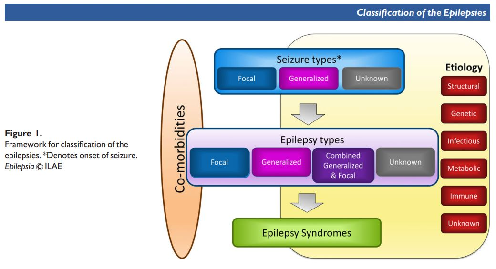

# Epilepsy Imaging 

[^Gill_2021]:Gill D, ILAE Update (Lecture) SPIN 2021.
[^ILAE_2019]:Bernasconi A et al, Recommendations for the use of structural magnetic resonance imaging in the care of patients with epilepsy: A consensus report from ILAE Neuroimaging Task Force. Epilepsia. 2019;60:1054–1068.DOI: 10.1111/epi.15612 Papers+
[^ILAE_2017]:Scheffer I et al, ILAE classification of the epilepsies: Position paper of the ILAE Commission for Classification and Terminology. Epilepsia, 58(4):512–521, 2017 doi: 10.1111/epi.13709 

## Diagnosis [^Gill_2021]

 

Defined as **"Recurrent, unprovoked seizures."** 
Important to get diagnosis right clinically, as per the ILAE Guidelines.[^ILAE_2017]
Important to get imaging right early to spot the lesions as per the ILAE guidelines.[^ILAE_2019]
Important to operate early on those with lesions to prevent DEE & because success of surgery is better earlier than later.  
`DEE = Developmental and Epileptogenic encephalopathy.`

## Imaging 

### Indications [^Gill_2021] 

ILAE published Guidelines in 2009 which put in modern lingo are:
1. Focal seizures (except BECTS)
2. Focal neuro history or exam, focal EEG findings.
3. Developmental regression
4. < 2 ys old
5. DEE (was called Symptomatic generalised Epilepsy Syndrome)
6. Status Epilepticus
7. Atypical course in any childhood epilepsy syndrome decline, poorly controlled seizures, focal spike on generalized epilepsy. 
`BECTS = Benign Epilepsy with Centrotemporal Spikes`  

NOT indicated for: 
- Childhood absence epilepsy.
- Juvenile absence epilepsy.
- Juvenile myoclonic epilepsy.
- BECTS

### Technical [^ILAE_2019]

Use ***HARNESS-MRI*** for all patients.  
This is:
1. Volume GE T1 whole brain. 1 x 1 x 1 mm 
2. Volume FSE FLAIR whole brain 1 x 1 x 1 mm
3. Cor T2 FSE Perpendicular to long axis of hippocampus 0.4 x 0.4 x 2mm (No gap). 

`HARNESS = Harmonized Neuroimaging of Epilepsy Structural Sequences`
### Reporting  

Should have the clincal details and EEG details before the scan. 
Inspect all the slices of the volumes on workstation using 1mm MPR.

#### Analysis for Temporal Lobe Epilepsy.
1. **Mesiotemporal Sclerosis (MTS)**
   1. Path: Cell loss and astrocytic gliosis in hippocampus AND amygdala, entorhinal cortex, temporopolar cortex and temporal lobe. 
   2. Radiology: 
      1. Mostly in hippocampus: Atrophy, loss of internal structure, decreased T1, increased T2.
      2. Also : Atrophy of ipsilateral fornix, mammillary body & temporal lobe esp pole.
      3. And occasionally Malrotation = vertical orientation and rounding of hippocampus, though this is of uncertain significance as can be developmental.  
      4. 3T demonstrates more subtle atrophy in specific places. Mesotemporal volumetry - mostly automated is probably better than visual at demonstrating atrophy.  
2. **Encephalocele of Temporal lobe**
3. **Parahippocampal dysplasia** 
   1. WM signal lesions with normal cortical thickness.
   2. So, look at the white matter throughout the temporal lobe.
4. **Nodular Heterotopia**
   1. Especially around the ventricle, so looke there carefully. 

#### Analysis for Focal Cortical Dysplasia  
1. **Type I** : Unclear MRI findings. 
2. **Type II** : 
   1. T1: Increased cortical thickness & blurring of grey-white interface (70%).
   2. T2: Grey matter hyperintensity esp on FLAIR (95%+) 
      1. 'Transmantle sign' = Funnel of signal from Grey matter to ventricle.
   3. NB often SUBTLE. Always inspect the bottom of deep sulci for thickening, preferably on axial images to allow comparison with other side.  

